# Location based notes application
This is a notes app that was written in Android Studio. The notes added by the user are displayed both as a sorted list by date and as markers on a map.

# Tech Used In App
1. The app was written in Android Studio in Java.
2. For authentication (login/signup) the app uses Firebase SDK.
3. The data on the notes is stored in a local DB using SQLITE.

# What You Will Find in the App
## Register
To register, the user must enter an email and password. The should be a proper email and the password should be at least 6 letters.

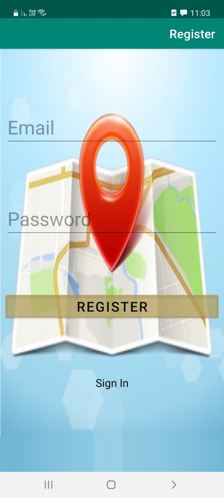

## Login 
To log in, the user must enter the email and password with which he registered

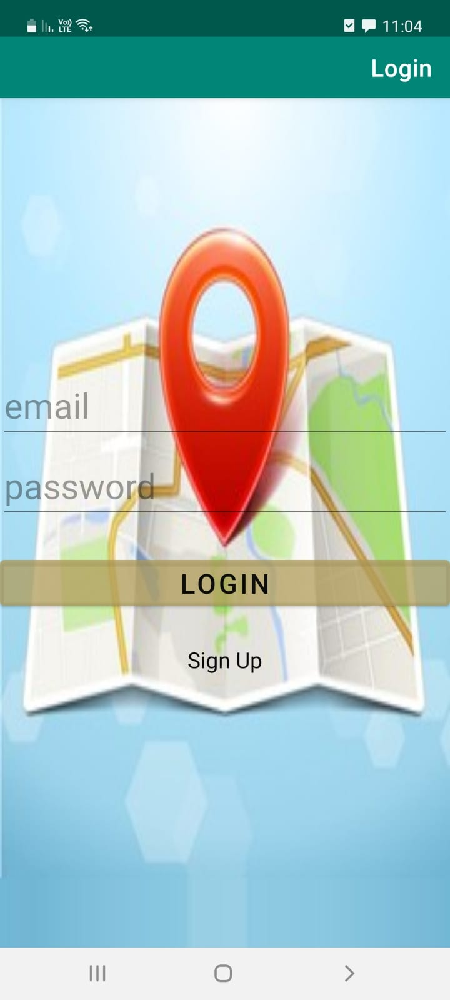

## Main Screen
### Top Menu
Contains a Welcome message, logout button and a button to create a new note.
# Map View
Contains a map of the world with the notes on it according to the locations where they were written.
# List View
Contains a list of the notes sorted by the creation date.
# Bottom Menu
Switching between List mode and Map mode

List view with no notes
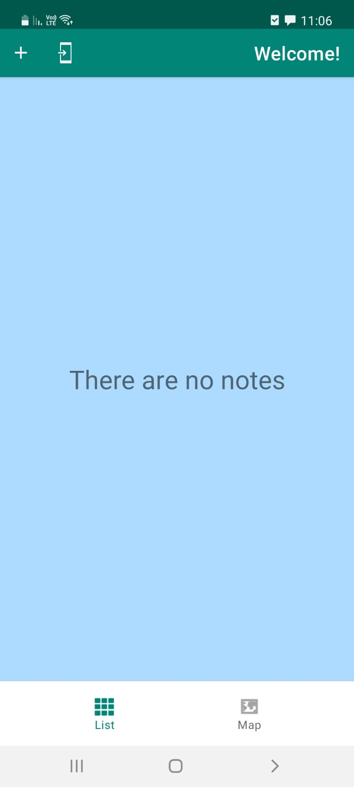]

List view with two notes
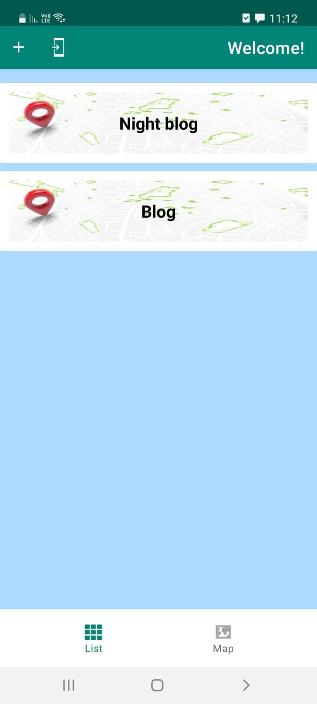

Map view with no notes
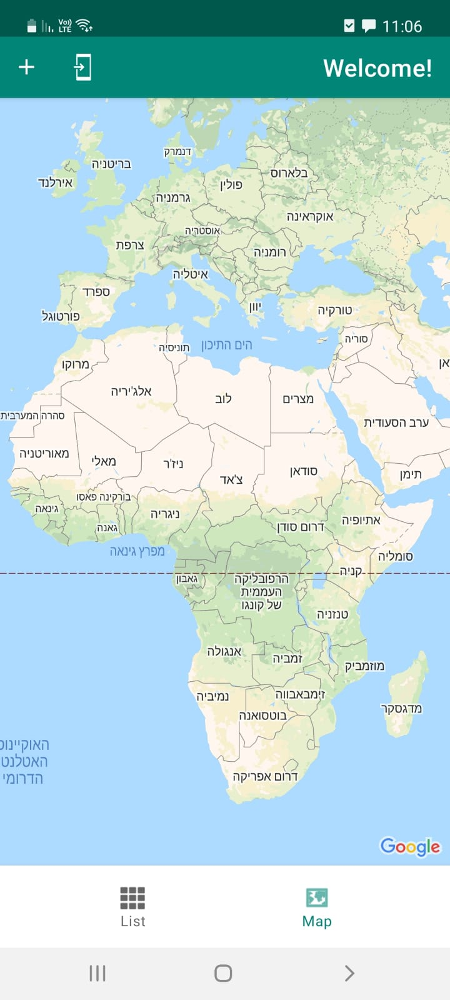

Map view with a note - zoom out
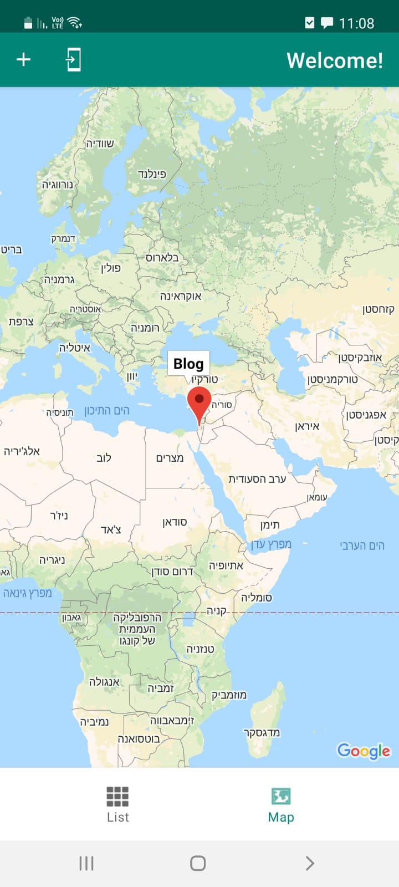

Map view with two notes in the same position - zoom in
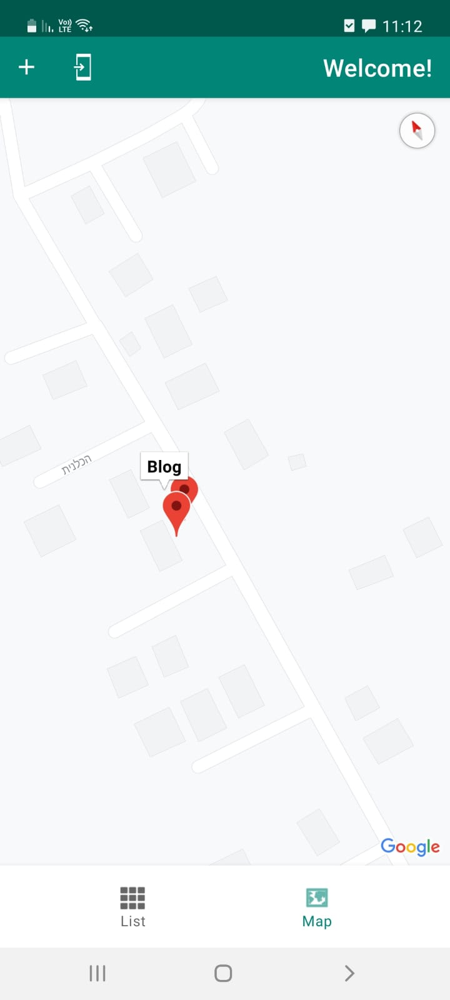

# Note Screen
When pressing add button or pressing on a note (in map or list view) note screen is opened.
The user must insert date, title and body, otherwise an error message will show. In addition it is optionally for the user to insert a photo for note.

Note screen when pressing new note
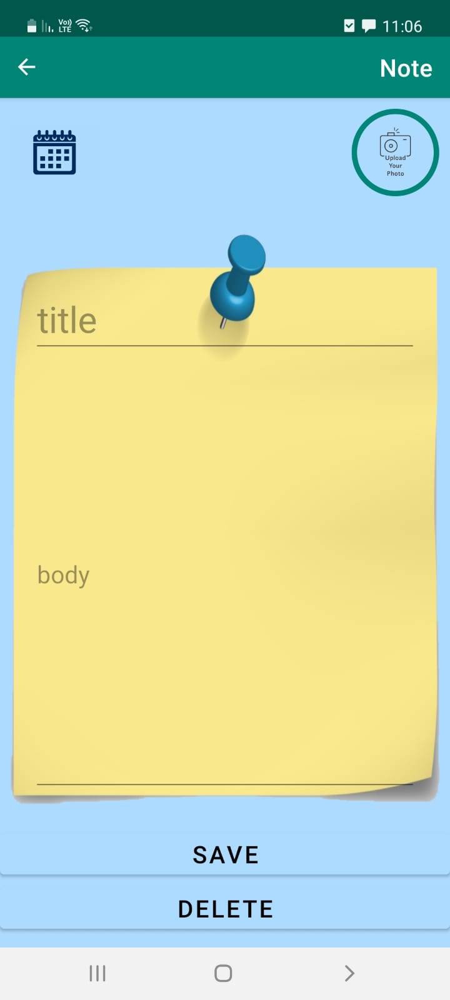

Note screen when pressing on a specific note or after adding all the properties
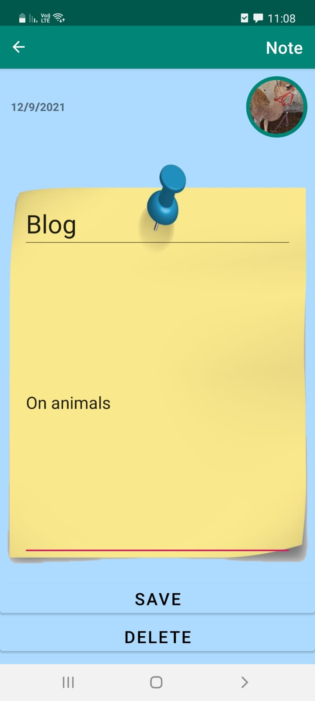

Note screen when adding a date
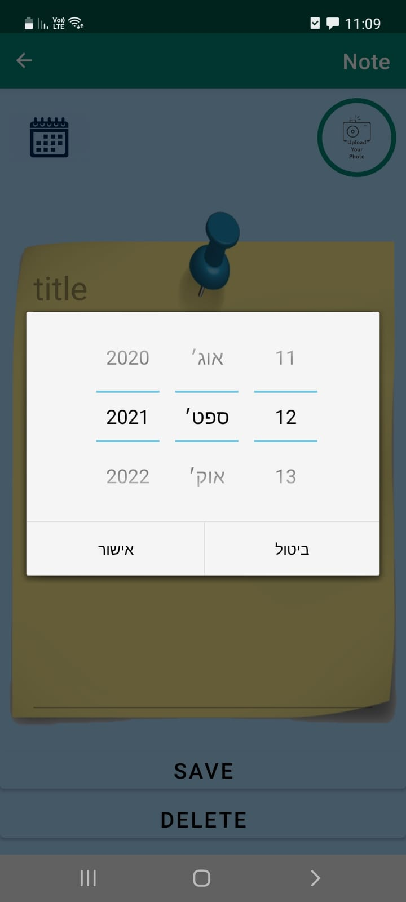

Note screen when pressing on add photo button
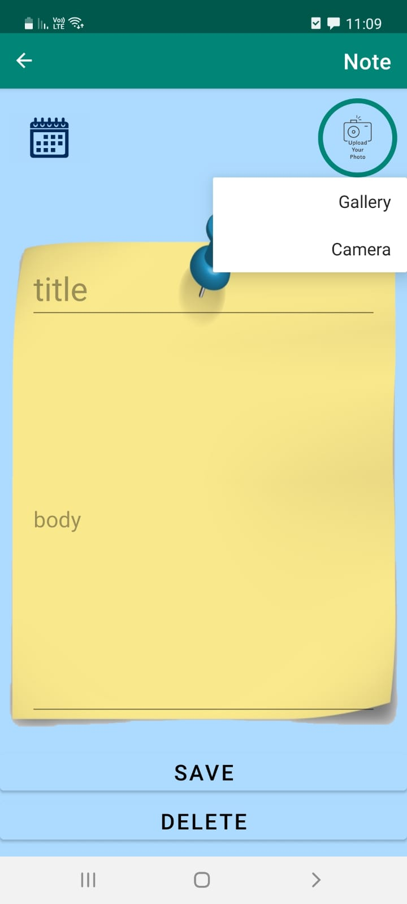